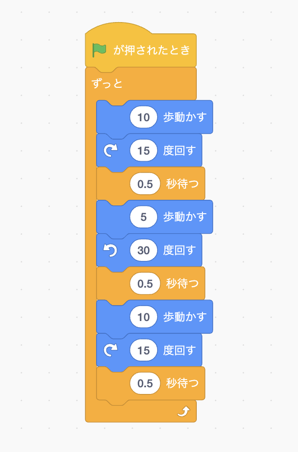

[トップ](../../) > [プログラミング基礎](../) > 関数

# 関数

## この章について

この章を読む前に、[プログラムの構造](../scratch/)を読んでおいてください。

この章では、似たプログラムを繰り返すときに便利な「関数」の使い方を解説します。

## 繰り返す処理

例えば、「猫を10歩進ませ右に15度回し、すこし待ち、5歩進ませ左に30度回し、すこし待ち、10歩進ませ右に15度回し、すこし待つ」という操作を繰り返せ、といわれれば、どのようにコードブロックを繋げますか?

指示をそのまま実装すればこんなふうになります。

