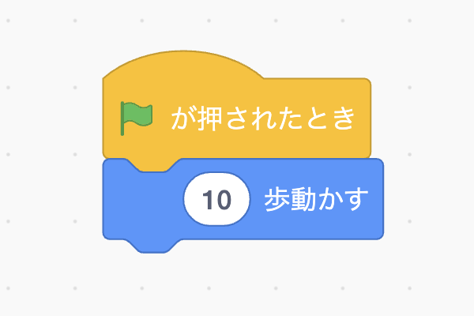
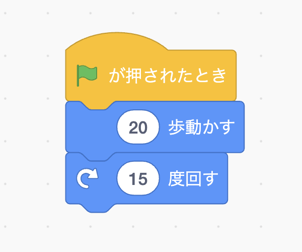
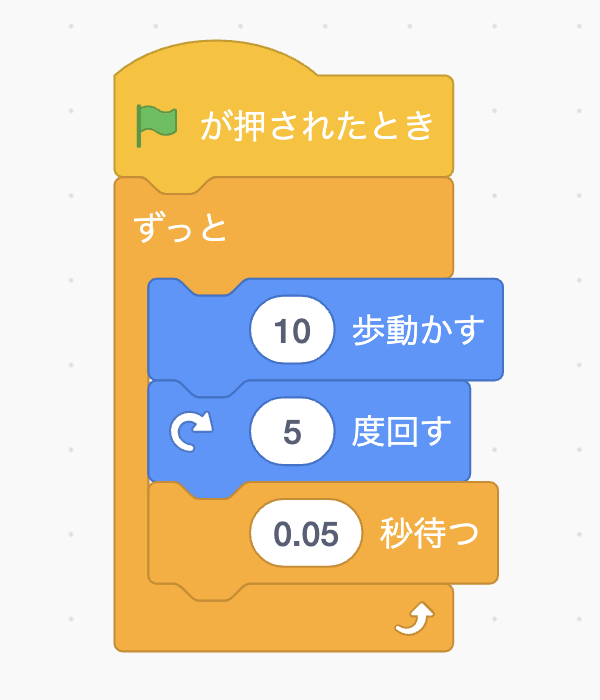

[トップ](../../) > [プログラミング基礎](../) > プログラムの構造

# プログラムの構造

## この章について

この章では、「プログラムをほとんど(全く)読み書きしたことがない」という方を対象にしています。

初めからプログラムを読もうとしても、記号やよくわからない単語だらけでよくわからないと思います。そこで、[Scratch](https://scratch.mit.edu/)という「プログラムを書かなくて良い言語」を利用して、プログラムの構造を捉えられるようになりましょう。

## Scratch

まずは[Scratch](https://scratch.mit.edu/)にアクセスしてください。アカウント作成はしてもしなくてもいいです。

上部のメニューにある「作る」というボタンをクリックすると、左にブロック、中央に空白、右にオレンジの猫がいる画面になります。(もしブロックの内容が英語なら、左上の地球マークから日本語に切り替えておきましょう。)

さて、Scratchでは何ができるのでしょうか。
Scratchでは様々なことができますが、主に右の猫を動かすことになります。

試しに、下記のようにブロックをつなげ、右上の旗ボタンをクリックしてください。

猫が少しずつ右に動きます。

このように、「旗が押された時」というイベントからブロックをつなげることで処理をすることができます。

このブロックはさらにつなげることもできます。
たとえば(大体)円状に回るようにしてみましょう。

この状態で旗を連打すると、少しずつ回って行くことがわかります。(わかりにくいため、移動距離を10から20に変えています。)

ただしこのままでは、ブロックを上から下になぞっているだけです。
猫を円運動させるにはどうすれば良いでしょうか。

いま旗を連打したように、青い二つのブロックを繰り返し実行したいですね。
そのような命令がないか探してみます。「制御」メニューの「ずっと」が使えそうです。

このブロックは他のブロックと違い、コの字になっており間に他のブロックを挟むことができます。
今回の場合、挟んだ部分が繰り返されるということですね。

スピード調整のためにループごとに少し待つようにしてみました。

これで実行すると、放っておいても猫が回り続けるはずです。

## まとめ

Scratchのブロックが縦に繋がって、すごろくのように順番に実行される、ということや、変数や関数といった仕組みの使い方がわかりましたか?
ぜひ、他のいろいろなブロックを使ってミニゲームなどを作ってみてください。

これだけでコードを書けるの?という感じもすると思いますが、このブロックを文字に置き換えるだけでコードになるようになっています。

JavaScriptか何かを使ったテキストプログラミングの基礎講座も作る予定です(まだできていませんが...)。ぜひ見てください。
