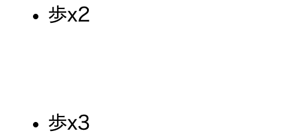

[トップ](../../) > [Web開発](../) > CSS

# CSS

HTMLというのは、Webページの見た目を作るための言語です。同じHTMLでも、CSSによって雰囲気が大きく変わります。

CSSを学習するためには、[HTML](../html/)の知識が不可欠です。先に学習しておいてください。

## このページの目標

HTML・CSSなどWebに関する技術は最近人気があり、わかりやすい解説書なども多く出版されています。それらを用いて学習しても構いません。

このページでは以下のようなことを学習します。

- 未定

## 学習の進め方

[HTML](../html/)のページで制作していた将棋盤を引き続き作っていきます。

CSSはHTMLに比べて覚える量が多く思えますが、記憶力がなくても検索力を身につければ問題ありません。よく使うものから覚えていきましょう。

## 将棋盤のデザイン

現在、以下のような見た目になっています。

到底将棋盤とは思えませんね。まず、中央の表が見えていません。

htmlのheadタグ内に、`<link rel="stylesheet" href="./style.css">`と記述し、htmlファイルと同階層に`style.css`というファイルを作成してください。

このようにして、HTMLファイルとCSSファイルを分けることができます。
