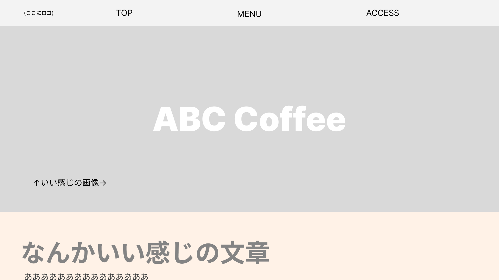
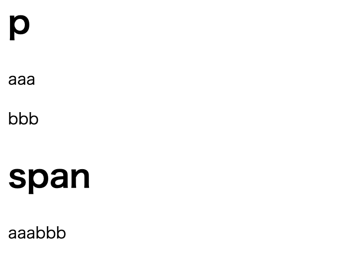
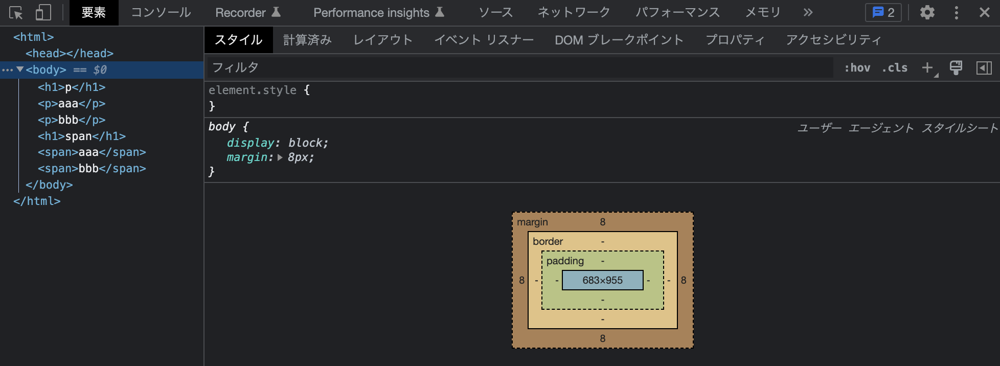
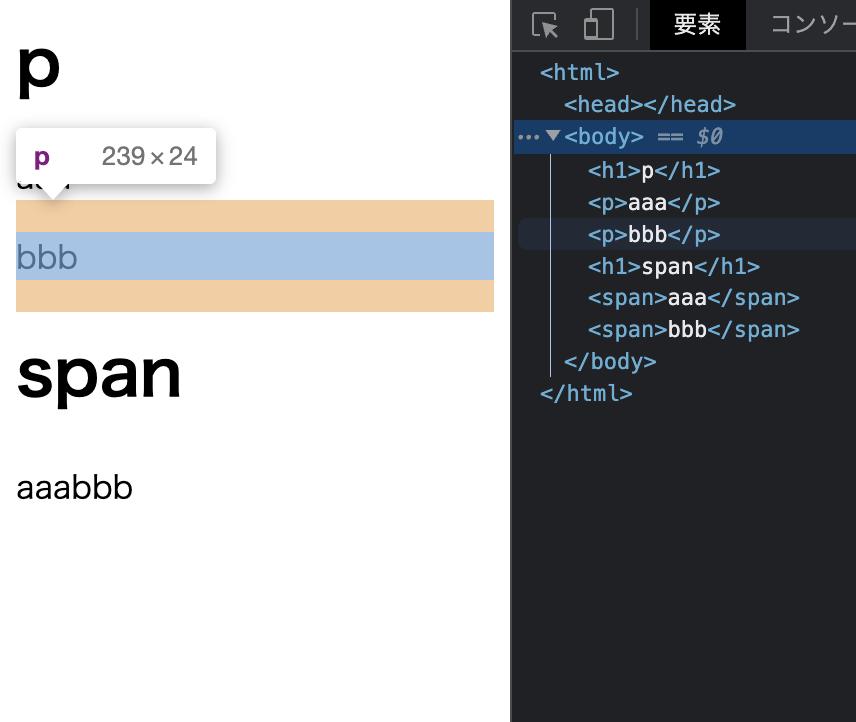
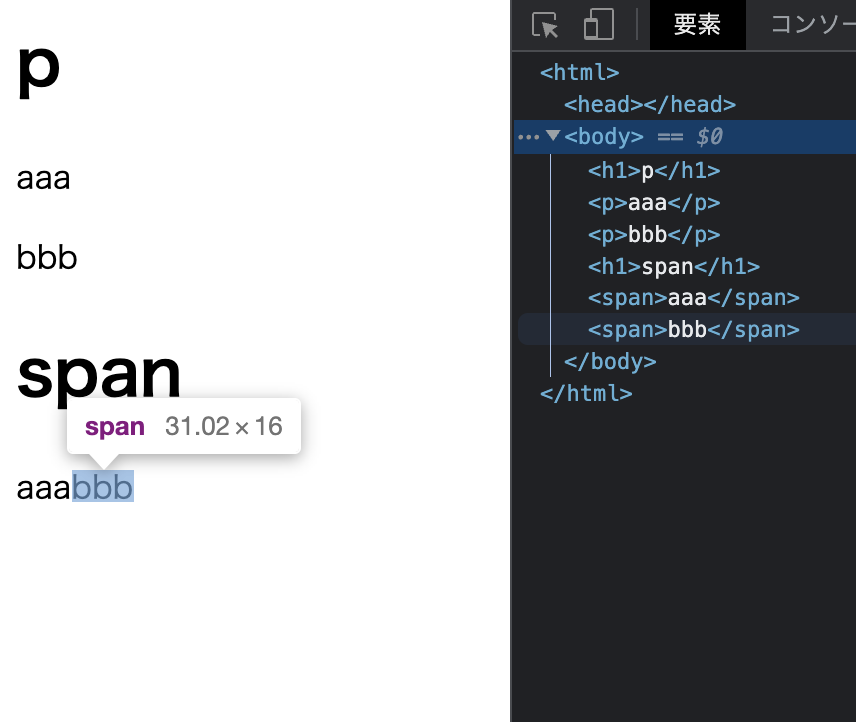
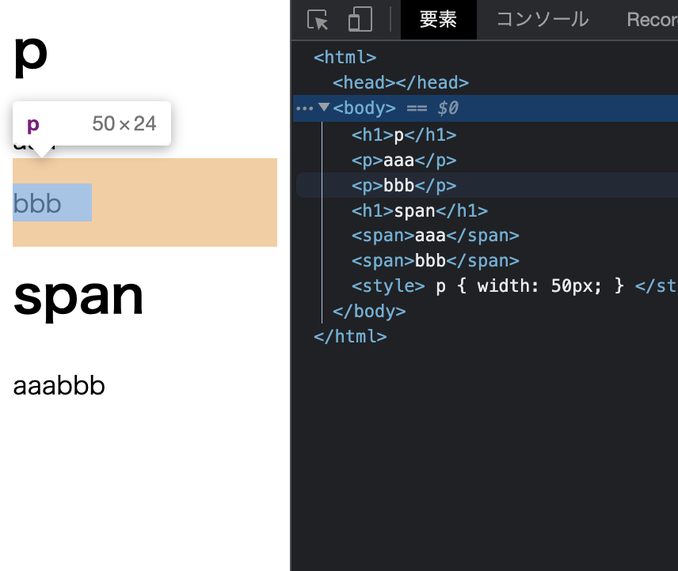
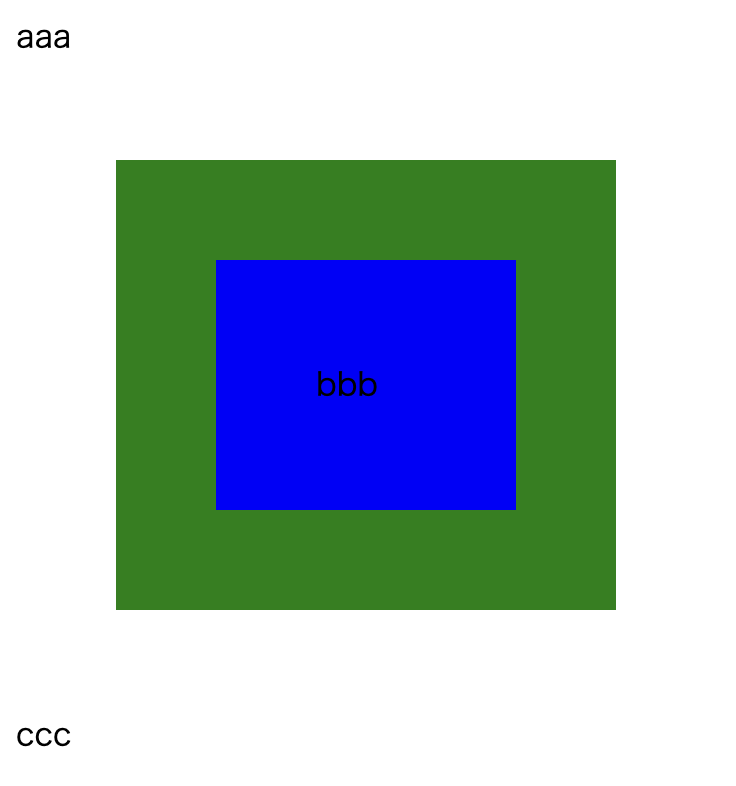
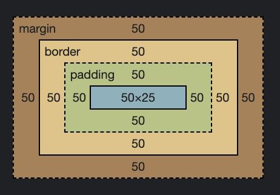

[トップ](../../) > [Web開発](../) > CSS

# CSS

HTMLというのは、Webページの見た目を作るための言語です。同じHTMLでも、CSSによって雰囲気が大きく変わります。

CSSを学習するためには、[HTML](../html/)の知識が不可欠です。このページではHTML編で作成したページを引き続き作成するので、先に学習しておいてください。

## このページの目標

HTML・CSSなどWebに関する技術は最近人気があり、わかりやすい解説書なども多く出版されています。それらを用いて学習しても構いません。

このページでは以下のようなことを学習します。

- 未定

## 学習の進め方

[HTML](../html/)のページで制作していたページを引き続き作っていきます。

CSSはHTMLに比べて覚える量が多く思えますが、記憶力がなくても検索力を身につければ問題ありません。よく使うものから覚えていきましょう。

## CSSの構造

htmlのheadタグ内に、`<link rel="stylesheet" href="./style.css">`と記述し、htmlファイルと同階層に`style.css`というファイルを作成してください。[[TODO ファイルパスこれでいい?]]

このようにして、HTMLファイルとCSSファイルを分けることができます。

CSSの書き方について説明します。

CSSは、見た目だけで言えばHTMLよりずっと簡単です。以下のコードを見てください。

```css
.sample_01 {
    margin: 10px;
    padding: 0;
    width: 20%;
    height: 100px;
    background-color: #000000;
}
```

これがCSSです。

`.sample_01`の部分がデザインを設定する対象、そしてその中身がデザインの内容の箇条書きです。

JSONなどを見たことがある方はしっくりくるかもしれません。

CSSには(基本的には)入れ子などもなく、これがほとんどすべてです。しかし、思い通りのデザインをするにはCSSの働きについて細かく理解していないといけません。少しずつ覚えていきましょう。

## ページの作成

では、早速作っていきましょう。まず、前回作ろうとしていたデザインを再掲します。



HTMLと同じように、上から作っていきます。

### 横レイアウト(ヘッダー)

まず、一番上に「ロゴ→TOP→MENU→ACCESS」と間隔を開けながら横並びになっているのが気になりますね。HTMLだけでは、これは作れません。

HTMLを見てみましょう。

```html
<header>
  
  <a href="./">TOP</a>
  <a href="./menu.html">MENU</a>
  <a href="./access.html">ACCESS</a>
</header>
```

`header`の中に4要素が並んでいる構造ですね。これら4つに対してCSSを書いていきます。

#### 要素の指定

CSSで装飾する先を選択するには3つほど方法があります。

1. タグ名から指定

2. classやidをつけて指定

3. 他の要素からの位置関係で指定

1の「タグ名から指定」は、今回の場合例えば「aタグに対して指定」などとすることです。

これは、ページ内のすべてのaタグに対して働くので、例えば「リンクは青文字にしたい」などすべてのaタグに装飾したい時には役に立ちますが、今回の場合は違います。

header内のaタグに対してのみ設定したいです。

2の「class/idで指定」は、それぞれのタグに名札をつけて、それで判別する方法です。もっともわかりやすいです。

classやidは次のように設定できます。

```html
<header>
  
  <a class="header-link" id="header-link-top" href="./">TOP</a>
  <a class="header-link" id="header-link-menu" href="./menu.html">MENU</a>
  <a class="header-link" id="header-link-access" href="./access.html">ACCESS</a>
</header>
```

そして、CSSからは次のように指定できます。

```css
#header-logo {
    // いろいろ
}
.header-link {
    // いろいろ
}
#header-link-top {
    // いろいろ
}
#header-link-menu {
    // いろいろ
}
...
```

idは`#`、classは`.`を入力したあと、つけた名前を入れるだけです。

> classとidは何が違うのでしょうか?
> 
> classは「ページ内に複数あるもの」、idは「ページ内に一つしかないもの」として名前をつけます。
> 
> イメージで説明しますが、idは名前みたいなものです。そしてclassはクラス分け、つまり学校のクラスのように、classからその人が一通りに定まらないものです。
> 
> 「太郎くん」は学年に一人しかいないものとすると、idは「太郎」です。1対1の対応がありますね。
> 
> これに対して、classは「1組」「男」といったような、1対多の対応があるものです。
> 
> 上の例を見てみると、header内のリンクはいくつかあるのでclassですが、header内の「TOP」へのリンクは1つしかないのでidとしています。
> 
> 実際はこのように個数で考えるのではなく、「絶対に1つか? 今から増やすことはないか?」と考えることが大切です。つまり、たとえニュースが1つだけだったとしても、`news-content`といったものをidにしてはいけません。
> 
> ちなみに、役割から考えるとわかるのですが、classは1要素にいくつかつけることができます。idは1要素1つと決められています。(本名みたいなものです)
> 
> `class="a b"`とスペース区切りで入力するだけです。CSSの`.a`、`.b`のどちらの設定も効きます。

これはこれでいいのですが、一つ一つidやclassを決めるのは大変です。TOPとMENUで何か変えるならいいのですが、今回「header内のaタグ」はすべて同じ設定で十分ですね。

3 の「位置関係で指定」は、一番わかりにくいのですが、使いこなすと非常に便利です。

次のコードを見てください。

```css
header > a {
    // いろいろ
}
```

見慣れない`>`記号がありますね。`A > B`となっている時、これ全体で「Aの一つ内側にあるB」を表すことができるのです。

この場合、`header`タグの一つ内側にある`a`タグということですね。これがやりたいことです。先ほどのように、すべての要素にclassやidをつける必要はなくなりました!

このような記号は他にもいろいろあります。以下に有名なものを書いておきます。

- `A B` : Aの内側にあるB (何重か内側でもOK)

- `A > B` : Aの一つ内側にあるB

- `A + B` : Aの一つあとのB、「Aと同じ階層にあってAの次にある」場合です。

- `A ~ B` : Aの一つあとのB、「Aと同じ階層にあってAよりあとにある」場合です。

また、これとは少し違いますが、`A, B`によって「AまたはB」とすることもできます。つまり、headerとfooterの両方に適用したいスタイルは、

```css
header, footer {
    // ここ
}
```

ここに書けばいいわけです。

> これを駆使すれば、
> 
> ```css
> header {
>     // いろいろ
> }
> header > img, header > a {
>     // aとimgで共通のスタイル
> }
> header > img {
>     // いろいろ
> }
> header > a {
>     // いろいろ
> }
> ```
> 
> といった複雑な設定も可能です。
> 
> (ちなみに`,`は最後に考えられます)

今回は、3番の書き方を採用することにします。

現時点でのhtml、cssはこんな状況です。

- index.html

```html
<header>
  
  <a href="./">TOP</a>
  <a href="./menu.html">MENU</a>
  <a href="./access.html">ACCESS</a>
</header>
```

- style.css

```css
header > a {
    // 今から書く
}
```

ここで、header内の3つのaを横並びにしなければいけません。

このために、インライン要素とブロック要素というもの、そしてデザインのための余白の作り方について理解する必要があります。

#### インライン・ブロック要素

次のコードを見てください。

```html
<h1>p</h1>
<p>aaa</p><p>bbb</p>

<h1>span</h1>
<span>aaa</span><span>bbb</span>
```

コードを見る限りではほとんど同じように見えます。pがspanに変わっただけですね。

しかし、実際の表示はこのように異なります。



pではaaaとbbbの間で改行が行われているのに対して、spanでは繋がっています。

これはどうしてでしょうか? まず、ブラウザに内蔵されている「開発者ツール」というものを使って、それぞれの大きさを見てみます。

ブラウザの`F12`というキーを押すと、下のような画面が表示されるはずです。



(レイアウトは上下などになっているかもしれません。違うものが表示されている場合、上部のタブなどを確認してください。)

ここでは、左側にHTMLのコード、右側にCSSが表示されるようになっています。この画面は後でよく使うようになりますが、今回使うのは左側だけです。

画面に映っている6行目、`<p>bbb</p>`にカーソルを合わせると、下のような表示になるはずです。



これは、その要素が実際はどれだけの大きさなのか、を表しています。青とオレンジの違いについては後で解説します。

これを見ると、要素が横幅いっぱいまで伸びていることがわかります。

次に、spanの方がどうなっているかも見てみましょう。



横幅、縦幅が共に小さく、文字の大きさだけしかないことがわかります。

これが、インライン要素・ブロック要素の大きな違いの一つです。

この場合、pがブロック要素、spanがインライン要素となっています。

ブロック要素は横幅いっぱいまで広がり、インライン要素はできる限り小さくなるということを覚えておいてください。

次に、pの2つに対して横幅を設定してみましょう。

HTML中に次のようなコードを書いてください。

```html
<style>
p {
    width: 50px;
}
</style>
```

このように、styleタグを使うことで、HTML中に簡単にCSSを書くことができます。

pに対してwidth、つまり横幅を指定しているわけですね。pxについては後で説明します。

> ここのwidthのようなプロパティについては、後でよく使うものを解説します。
> 
> 今は覚えなくて大丈夫です。

これで、表示は次のようになります。



どうですか? 予想した通りになっていましたか?

実は、ブロック要素に横幅を指定した場合、右側に余っているスペースがすべてオレンジ色で埋まってしまっています。

これは、ブロック要素の特徴の一つです。横幅が余っている場合でも、ブロック要素はまるで「自分の右側に改行がある」ような動作をします。

また、CSS部分のpをspanに変えてみればわかりますが、インライン要素にはサイズは指定できないです。

以上をまとめると、次のようになります。

|           | インライン要素 | ブロック要素        |
| --------- | ------- | ------------- |
| デフォルトのサイズ | 最小値     | 高さは最小値、横幅は最大値 |
| 次の要素の場所   | すぐ右     | 下             |
| サイズ指定     | 不可能     | 可能            |

> 実は、現在のHTML/CSSにおいてはインライン要素・ブロック要素という区別はありません。HTML5では、次のようなグループ分けがされています。
> 
> - メタデータコンテンツ
> - フローコンテンツ
> - 区分コンテンツ
> - 見出しコンテンツ
> - 記述コンテンツ
> - 埋め込みコンテンツ
> - 対話型コンテンツ
> 
> インライン要素の大部分は記述コンテンツに含まれています。とはいえ、これらを区別して考えずとも、ブロック・インラインという区別ができればまあ問題ありません。
> 
> 仕様上は別の区別がされている、ということだけ覚えておいてもいいかもしれません。

#### 余白

Webデザインにおいて、もっとも大切なものは余白と言っても過言ではありません。CSSはデザイン用のものなので、余白について細かく指定できるようになっています。

まず、CSSにおいて、余白は「padding」「border」「margin」の3種類があり、この順に内→外と配置されています。

ここは、実際に使ってみないとしっくりこないところです。次のようなコードで実験してみます。

```html
<span>aaa</span>
<div class="test">bbb</div>
<span>ccc</span>
<style>
.test {
    width: 50px;
    height: 25px;

    padding: 50px;
    border: 50px green solid;
    margin: 50px;

    background-color: blue;
}
</style>
```

次のような表示になりますね。



内側からどのように指定されているか見てみましょう。

このdivを選択した上で、先ほども使用した開発者ツールの、四角が重なったようなところを見てください。



このdivは、実際にこの通りの構造になっています。必要に応じて、開発者ツールにマウスをホバーしてみてください。

まず、一番内側のテキストの部分が50x25のサイズになっています。そして、その外側、上下左右の4方向にpaddingとして50pxづつ隙間が作られています。

また、その外側にまた4方向に50pxずつborderが配置されています。borderはその名の通り「枠線」の作成用なので、marginやpaddingとは少し文法が違います。「50px green solid」と、サイズ・色・線の種類(solid=実線)の情報を渡す必要があります。

この、「width・heightサイズ+padding+border」が、HTML/CSSにおいては「本体のサイズ」として認識されています。開発者ツールでも、borderとmarginの間のみ実線で区切られていますね。

この「本体のサイズ」は何に使われるのかというと、例えば今回の「background-color」、つまり背景色です。borderの下にあるかどうかは判別しづらいですが、それより外には色がついていないことがわかると思います。

そしてその外側にmarginがあるわけですね。

> 時には、「width・heightサイズ+padding+border」のサイズになるのではなく、「padding・borderを含めてwidth・heightサイズになる」という挙動の方が理解しやすい場合もあります。
> 
> その場合、`box-sizing: border-box`というCSS設定を記述することで、その要素に対してサイズの取り方を変更できます。
> 
> コード内で混在している場合、レイアウトが予想外のずれ方をする原因となってしまいます。どうしてもレイアウトがおかしくなる場合、今レイアウトしようとしている要素のbox-sizingが何になっているかを確認するのも重要かもしれません。

このように、CSSには3種類(borderを除けば2種類ですが)の余白があります。これらをいきなり使いこなすのは難しいと思いますが、余白はデザインにおいて非常に大切な要素です。慣れていってください!

#### レイアウトの作成

さて、ようやくインライン・ブロック要素、そして余白の説明が終わりました。長かったですね...

これで、ようやくヘッダーの作成に戻ることができます。現在のコードをもう一度表示しておきます。

- index.html

```html
<!DOCTYPE html>
<html>
  <head>
    <meta charset="utf-8">
    <title>ABC Coffee | TOP</title>
    <link rel="stylesheet" href="./style.css">
  </head>
  <body>
    <header>
      
      <a href="./">TOP</a>
      <a href="./menu.html">MENU</a>
      <a href="./access.html">ACCESS</a>
    </header>
    <div>      <!-- メインコンテンツ -->
      <div>    <!-- 画像部分 -->
        
        <h1>ABC Coffee</h1>
      </div>
      <div>    <!-- 文章部分 -->
        <h2>なんかいい感じの文章</h2>
        <p>ああああああああああ</p>
      </div>
    </div>
    <footer>
      
      <span>© 2023 ABC Coffee</span>
    </footer>
  </body>
</html>
```

- style.css

```css
header > a {
    // 今から書く
}
```

まずは、aタグをブロック要素にして、サイズを指定してみましょう。

次のようなCSSになります。

```css
header > a {
    display: block;
    width: 250px;
    height: 50px;
    background-color: gray;
}
```

ブロック要素の指定は、`display: block`で可能です。また、わかりやすいように、`background-color`で色をつけています。

以下のような見た目になります。

[[ TODO 画像 ]]

残念なことになっていますね。まずは、文字をそれぞれの真ん中に持ってきましょう。

HTML/CSSでは、この「中央揃え」はかなり難しく、いくつかのテクニックがあります。ここでは、その中でもかなり使いやすい、「table-cell」を使った方法を紹介します。

といっても簡単で、「中央寄せの基準になる外枠」の要素に、`display: flex;  align-items: center; justify-content: center;`の3つのスタイルをつければ良いです。2つ目と3つ目で、それぞれ縦方向の中央、横方向の中央を表しています。

今回は、ブロック要素のaタグが外枠、中央寄せされるのは中のテキストです。中のテキストにタグがついていないので、spanをつけておきましょう。

次に、aタグに先ほどの中央寄せスタイルをつける...としたいのですが、よく見るとaタグにはすでに`display: block;`がついていますね。displayの設定が被ってしまいます。

`block`と`flex`が被ってしまいました。ここで、なぜ`block`をつけたか考えてみます。サイズを指定するためでしたね。実は、`flex`もサイズを指定することができます。よって、ここでは`block`をやめて`flex`を使うことにします。

> `display: flex`とは何だ? と思われた方も多いと思います。
> 
> これを一言で説明するのは難しいのですが、子要素を自由にレイアウトできるもの、という感じです。今回も、「中央寄せ」というレイアウトをしていますし、のちに使う「横並び」や、「横幅に応じて折り返し」、「一定の比率で配置」など様々なことに使えます。ぜひ覚えておいてください!

```html
<header>
  
  <a href="./"><span>TOP</span></a>
  <a href="./menu.html"><span>MENU</span></a>
  <a href="./access.html"><span>ACCESS</span></a>
</header>
```

```css
header > a {
    display: flex;
    align-items: center;
    justify-content: center;
    width: 250px;
    height: 50px;
    background-color: gray;
}
```

このレイアウトは以下のようになります。

[[ TODO ]]

綺麗になってきましたね!

次に、この3つのリンクを横並びにしたいと思います。横並びの際にも、先ほど使った`display:flex`を使うことができます。(というより、こちらの方が正しい使い方です)

flexは、子要素のレイアウトを指定します。つまり、並べたいものの一つ外側に設定します。今回の場合、aを並べたいのでheaderに設定します。

また、flex内の要素は`align-items`で縦方向の位置、`justify-content`で横方向の位置を調整できます。(先ほども使ったやつです。)

今回は、とりあえず中央寄せにしてみましょう。`justify-content: center;`です。

```css
header {
    display: flex;
    justify-content: center;
}

header > a {
    display: flex;
    align-items: center;
    justify-content: center;
    width: 250px;
    height: 50px;
    background-color: gray;
}
```

次に、このリンクの青い文字を黒に変えます。

リンク、つまりaタグは、元々青くなるようにスタイルが指定されています。これを解除しましょう。

aタグには、元々次のようなスタイルが設定されています。なお、これは開発者ツールで見ることができます。

```css
a:-webkit-any-link {
    color: -webkit-link;
    cursor: pointer;
    text-decoration: underline;
}
```

コロン以下の`:-webkit-any-link`は気にしなくて良いです。これを見ると、テキストの色の`color`、マウスを乗せた時にカーソルを変更する`cursor`、下線を引く`text-decoration`の3つが設定されているようです。

ここで、気に入らない部分を自分で上書きします。

> CSSの上書きの条件とはどんなものでしょうか。
> 
> CSSでは、原則「後に書かれたものが優先」となっています。
> 
> Chromeなどが勝手に指定しているスタイルは「ユーザーエージェントCSS」と呼ばれ、最も最初に書かれていることになっています。つまり、適当に自分でCSSを書けば、勝手に上書きしてくれるということです。

このようにしてみました。

```css
header {
    display: flex;
    justify-content: center;
}

header > a {
    display: flex;
    align-items: center;
    justify-content: center;
    width: 250px;
    height: 50px;
    background-color: gray;
    color: black;
    text-decoration: none;
}
```

さて、まあまあいい感じになってきました。次は、blackやgrayなどではない、中途半端な色の指定方法を学んでみましょう。

#### カラーコード

ほとんどのコンピューターの画面では、ピクセルごとに1600万色以上の色を表すことができます。(よくゲーミングデバイスの宣伝に使われている数字ですね。) すごいですね!

この色の指定方法ですが、当然、一つ一つにredやblueといった名前がついているわけではありません。

例えば、12色ほどの絵の具を持っているとします。この時、好きな色を作るには、どうすれば良いでしょう? 当然、色を混ぜますよね。パソコン上でも同じです。

絵の具の場合、「シアン(青)」「マゼンタ(赤)」「イエロー(黄)」の3色が、画面、つまり光の場合「赤」「青」「緑」の3色があれば全ての色を表すことができることが知られています。

しかし、ここで問題があります。現代のコンピュータでは全てはデジタルデータなので、「ちょっとだけ赤を足す」ような表現はできません。数字で表す必要があります。

目で判別できる色の細かさなどから、現在の画面では、ほとんどの場合3色x256段階で表現します。赤を128、緑を2、青を255、といった感じです。(コンピュータの都合上、0~255で表します。)

これは、それぞれの色の頭文字からRGBと呼ばれ、RGB(128, 2, 255)と表せます。これでは面倒だと考えた人がいたようで、それぞれを16進数に直し、2桁にしてそのまま連結した形で色を表すことも多いです。

例えば、先ほどの色(128, 2, 255)であれば、`#8002FF`ですね。(色であるとわかるよう、最初に`#`をつけています。)

この16進数表記を脳内で完璧な色に直せる、といった能力は必要ありませんが、何となくの色はイメージできると便利です。

ちなみに、`#8002FF`は明るめの紫くらいの色です。`#000000`は真っ黒、`#FFFFFF`は真っ白です。白黒くらいは覚えておいてもいいでしょう。

#### 背景色

さて、このカラーコードを使い、リンクの背景の色を見やすくしてみましょう。現在、ここはグレーになっています。グレーの上に黒を置いており、あまり読みやすいとは言えません。もう少し薄い色がいいですね。

今回は、`#DDDDDD`を使ってみます。今まで色を指定してきたところに、これを直接書いてください。

(また、リンクの背景に色があるのもおかしいので、背景色はheader全体につけることにしました。)

```css
header{
    background-color: #DDDDDD;
    /* 略 */
}

header > a {
    /* 略 */
    /* 削除→ background-color */
}
```

これで、以下のような見た目になります。非常に読みやすくなりました!

[[ TODO ]]