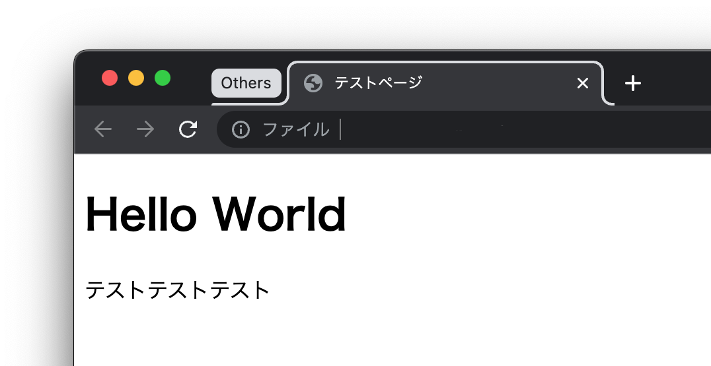
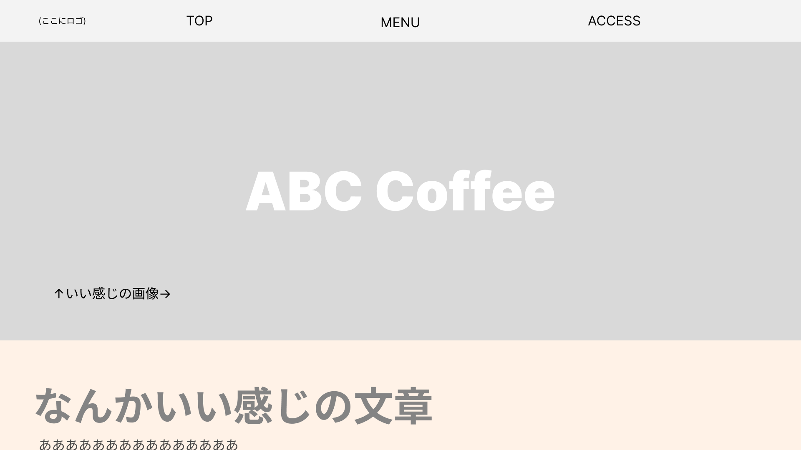

[トップ](../../) > [Web開発](../) > HTML

# HTML

HTMLというのは、Webページの本体を書くための言語です。

Web制作において、ツールやテンプレートだけを使った簡易的な制作を除けば、必ず必要な技術です。頑張ってください!

## このページの目標

HTMLなどWebに関する技術は最近人気があり、わかりやすい解説書なども多く出版されています。それらを用いて学習しても構いません。

このページでは以下のようなことを学習します。

- HTMLとは何か
- HTMLのタグ構造の理解
- HTMLの基本的なタグ(`head`、`body`、`div`、`span`、`table`等)

## 学習の進め方

まず、「Webページ」とはどういうもので、どうやって表示されるのかをさらっと解説します。

その後、実際の制作に入っていきます。Web制作には、まず「HTML」「CSS」で表示を行い、「JavaScript」で動作を作ります。この3つをマスターすれば、あまり不自由なくWeb制作ができるようになります。まずはこの3つの習得を目指します。

このサイトでは、HTML、CSS、JavaScriptの学習を通して、実際に遊べる「将棋盤」を作ってみようと思います。

とりあえず、HTMLの学習を始めてみましょう。

## Webページとは

皆さんはWebページを見るとき、スマホやパソコンを使うはずです。その中で、「Safari」「Chrome」「Edge」といったアプリを開くと思いますが、これは一体どのような仕事をしているのでしょうか?

インターネットに接続する、と答える方が多いと思います。しかし、Twitterやソシャゲもインターネットに接続していますが、先ほどあげたアプリは使っていません。

実は、Safari、Chromeなどのアプリは、「HTMLを表示する」という仕事を行なっています。このようなアプリをブラウザと呼びます。

まず、Webページを見るとき、私たちは「URLをブラウザで開く」という操作をしています。Googleなどで検索し、リンクをクリックするのも、QRコードを読むのも同じです。

その時ブラウザは、指定されたURLにHTMLファイルをもらいに行っているのです。

例えば、<google.com>を入力すると、ブラウザがgoogle.comに向かって「WebページのHTMLデータをください」と通信します。するとgoogle.comが送ってくれますが、これはHTMLです。このままでは、ただのコードであり、いつも見ているような綺麗な画面にはなりません。ブラウザはこれを解読し、わかりやすく表示してくれているわけです。

> この辺の話をもっと詳しく知りたい方は、ぜひ[ネットワーク]()(未作成)などのページを見てみてください。

今から僕たちがしようとしているのは、この「送り返すHTMLファイル」を作ることです。このためには、HTMLを軽く読めるようになっておかなければなりません。

## HTMLを読んでみる

さて、実際にHTMLを読んでみましょう。

実際のページのものを拾ってきても良いのですが、あまりに複雑なものがほとんどです。(最近の大規模なページの多くはHTMLを自動生成しているため、人にとって読みやすいコードではないのです)

そのため、最小限のHTMLを書いてみました。

```html
<!DOCTYPE html>
<html>
  <head>
    <meta charset="utf-8">
    <title>テストページ</title>
  </head>
  <body>
    <h1>Hello World</h1>
    <p>テストテストテスト</p>
  </body>
</html>
```

このままでも文字の部分だけ抜き取れば読めないことはないですが、あまりはっきりとはわかりませんね。これをテキストファイルに保存して、拡張子を`.html`に変えてダブルクリックすれば、ブラウザがいい感じに表示してくれるはずです。

> Windowsの方は、デスクトップなど好きな場所で右クリック→新規作成→テキストファイル をクリックし、名前を好きに決め、メモ帳などで開き上記のコードを貼り付け、ファイル名の`.txt`となっている部分を`.html`にすればOKです。

きっと以下のような表示になります。



Hello Worldの部分は大きく、テストテストテストの部分は普通の文字サイズで表示されていますね。また、タブ部分のサイト名が「テストページ」になっています。

これを参考に、先ほどのコードを1行ずつ見ていきましょう。

まずコードをよく見てみると、`<aaa> ... </aaa>`という構造があるのがわかると思います。

これがHTMLの基本構造です。それぞれ、「開きタグ」「閉じタグ」と名前がついています。

まず1行目。`<!DOCTYPE html>`となっていますが、これは「このファイルはHTMLファイルだよ」という宣言です。ブラウザがHTML以外を読み込むことなんてほとんどないのですが、一種のおまじないです。覚える必要はありません。

2行目。`<html>`と、htmlタグが始まりました。基本的に、全ての内容をhtmlタグの中に書いていくことになります。

3行目。`<head>`と、headタグが始まりました。ここから行頭をスペースであげていますが、なくても問題ありません。見やすくしているだけです。

headタグの中には、「ページに表示されないもの」を書きます。そんなもの必要なのか?という感じですが、まあ見てみましょう、

4行目。`<meta charset="utf-8">`と、metaタグなんでしょうが、何かよくわからないものがついていますね。このように、タグに`〇〇=〇〇`とつけているものもあり、これを「属性」と呼びます。いくつかついていることもあります。

これはmetaタグですが、その名の通り「メタデータ」を設定します。メタデータとは、ページの設定くらいに思っておけば大丈夫です。つまりmetaタグは、ページの設定を変えるものなのです。どの設定をどう変えるのか?というのは、属性で指定します。この場合、`charset`設定を`utf-8`に変えています。これによって、日本語を使った時の文字化けを防ぐことができます。

> 実は、この世界には「文字コード」というものがあります。パソコンの中では、すべてのデータは2進数で保存しています。例えばa=1、b=2、...というように、文字と数字の関係を決めておかなければいけません。「あ」や「汉」、「𓄿」といった文字までも数字を割り振らなければなりません。困ったことに、世界中の人々がこのような対応表を作ってしまい、間違った表で解読してしまうといわゆる「文字化け」が起こってしまうのです。
>
> 例えば、「あいうえお」をUTF-8という規格で数字化し、Shift-JISという規格で読んでしまうと、「縺ゅ＞縺?∴縺」となってしまいます。よく見るやつですね。これでは読めません。
>
> これを防ぐために、「このファイルはUTF-8で書いています!」と設定しているわけです。

また、metaタグには閉じタグがありません。このように、たまに「閉じタグがないタグ」も存在します。検索すればわかりますし、エディタも教えてくれるので、頑張って覚える必要はないでしょう。

5行目。`<title>テストページ</title>`と、titleタグです。また新しいタグが出てきました。これは、名前の通りページタイトルを表示するタグです。タイトルと言ってもページ自体には表示されず、上のタブ部分に表示されるだけですね。

このように、「ページ自体には表示されないが、ページのデータには入れておきたい」ものは、headタグ内に配置することが多いです。

6行目の`</head>`はいいとして、7行目では`<body>`とbodyタグが始まります。bodyタグの中には、ページに実際に表示されるものを書いていきます。つまり、Web制作の本体というわけです。

8行目では`<h1>Hello World</h1>`と、h1という数字のついたタグですね。ここはページに大きな文字で表示されました。実はh1というのは「Heading #1」の略で、Headingは見出しのことです。つまり、「一番大きい見出し」のことです。察している方もいるかもしれませんが、h1~h6まで存在し、少しずつ小さく、弱くなっていきます。

9行目、`<p>テストテストテスト</p>`はpタグです。これは「Paragraph」、つまり段落のタグです。普通のサイズで表示されます。基本的に、特に特徴のないテキストはここに入れておけばいいと思います。

10,11行目はタグを閉じているだけなので、気にする必要はありません。

さて、先ほどのコードを読むことができました!

これだけコードを書いてこの表示?と思うかもしれませんが、見た目に反映されるのはbodyの中だけで3行ですし、その他の部分はしばらく変わらないと思うのでコピペでいいです。

この解説を読んで、「タグめちゃくちゃ覚えないといけないのでは...?」と思ったかもしれませんが、実際はそんなにありません。bodyタグの中で使うものといえば、まあこのくらいでしょう。

- h1~6 ... 見出し、1が一番大きく6が一番小さい
- p ... 段落
- a ... リンク、`<a href="https://google.com/">リンクテキスト</a>`
- ul/ol/li ... リストを作れる、あとで解説
- div ... 特に意味はないけどまとまりを作りたい時、あとで解説
- span ... 特に意味はないけどまとまりを作りたい時その2、あとで解説
- img ... 画像、``

これ以外は、必要な時に調べる感じでいいです。ここに書いてあるものも、検索ですぐに思い出せるのならば、完璧には覚えていなくてもいいはずです。まあすぐ覚えるでしょう。

> 見出しや画像、段落などといったタグを見て、まるでWordだなと思った方もいると思います。実際その通りなのです。HTMLとはHyperText Markup Languageの略で、マークアップ言語、つまり文書の構造を記述するための言語なのです。
>
> こういった意識を持っておくと、タグをどう配置すればいいか考えやすくなると思います。

## HTMLを書いてみる

さて、読めるようになったので早速書いてみましょう。

まずはエディタを入れます。メモ帳でも可能ではありますが、逆にめちゃくちゃ難易度が高いです。[テキストプログラミング/VSCodeのインストール](../../programming/text/#VSCode)(未作成)を参考にして、Visual Studio Codeを入れてください。

### 要件定義

すぐにでも書き始めたいですが、まず「なにを作るか」を明確にしましょう。このような作業を「要件定義」と言います。簡単でもいいのでしておきましょう。

今回は、サンプルとして「架空のカフェのホームページ」を作ります。このようにテーマが決まると、どのようなページを作れば良いかが決まってくるはずです。

店の名前は「ABC Coffee」としておきます。「ホーム(トップページ)」「メニュー」「アクセス」と3ページにわけて作ることにします。もちろん、この程度の量であれば1ページに全てまとめてしまってもOKです。

### デザイン

さて、デザインを軽く決めましょう。

デザインを決める場合、「文字色」「アクセント色」「背景色」を決めると、簡単に綺麗なデザインを作りやすいです。基本的に文字色や背景色、白や黒で作っておいて、強調したいところにアクセント色を使う感じです。あまりにたくさんの色を使うとゴテゴテして見にくくなってしまいがちです。

今回作るのはカフェなので、なんか綺麗な感じにしたいですね。背景色を薄いベージュ、文字色を灰色、アクセントを薄い緑としておきます。

各ページのレイアウトを大まかに決めておきましょう。こんな感じに下書きを作ってみました。



こういうふうなデザインはAdobe IllustratorやAdobe XD、Figmaといったアプリケーションで作ることができます。

> このデザインは、横1920px、縦1080pxという設定で作っています。これはフルHDと呼ばれ、多くのパソコンはこの画面サイズです。ただ、スマホでの利用の方が多いと思われる場合は縦長の画面デザインを先に作った方が良いですし、将来多くの人が高解像度な画面を持つようになればより大きなサイズで作った方が良いでしょう。

### 書いてみる

実際に書いてみます。

まず、好きな場所にフォルダを作ってください。`Desktop/Programming/Web_Cafe`など、わかりやすい場所でOKです。

そのフォルダをVSCodeで開きます。「ファイル」→「フォルダーを開く」でそのフォルダを選べばOKです。

左側の一番上、ファイルアイコンのタブを開き、ファイルを作成します。`index.html`というファイル名にしておいてください。

> どうして`index.html`なのでしょう? 例えば、ブラウザに`https://google.com/`と打ち込んだことを想像してみてください。これは、`/`で終わっていることからもわかるように、フォルダを表しています。HTMLファイルではありません。この場合、ブラウザはどうするのでしょうか。
>
> 実は、フォルダを開いた場合、その中に`index.html`というファイルがあれば、勝手にそれを開いてくれます。つまり、`https://google.com/`を開くことと、`https://google.com/index.html`を開くことは同じです。
>
> このことから、`/`で終わった時勝手に開いて欲しいページ、例えばトップページなどは`index.html`という名前で作成すると良いです。

さて、index.htmlのなかに、先ほど作ったデザインを作らなければいけません。ただし、まだHTMLだけなので、構造を指定する以上のことはできませんが...

まず、HTMLのテンプレートのようなものを書いてしまいましょう。

```html
<!DOCTYPE html>
<html>
  <head>
    <meta charset="utf-8">
    <title>ABC Coffee</title>
  </head>
  <body>
    <!-- 今から書く -->
  </body>
</html>
```

> コード中に`<!-- -- >`となっている部分がありますが、これはコメントといいます。
>
> この中であれば、なにを書いてもエラーにならず無視されます。日本語も書けます。ちょっとしたメモを書いておくとあとでコードを読みやすいです。

さて、先ほどのレイアウトですが、HTMLでは基本的に上から詰めて配置されます(普通の文章と同じですね!)。なので、一番上に並んだリンク集のようなところを作っていきましょう。このような場所をヘッダーといいます。HTMLには`<header>`というタグがあるので、これを使ってみましょう。(使わなくても問題ありませんが、使ったほうがわかりやすくなります)

また、これも普通の文章と同じなのですが、HTMLで要素を配置するとき、左から右に書いていきます。今回の場合、ロゴ→TOP→MENU→ACCESS となっていますね。

ロゴの部分は画像を貼りたいので、``タグを使います。

> `img`タグは本来はsrc属性に加えて`alt=""`という属性を使うべきなのですが、ここでは省略します。

また、3つの文字の部分は別ページへのリンクにしたいです。リンクなので、`<a>`タグが使えます。移動先のURLは後で決めます。

```html
<!-- 略 -->
<body>
  <header>
    
    <a href="(後で)">TOP</a>
    <a href="(後で)">MENU</a>
    <a href="(後で)">ACCESS</a>
  </header>
</body>
<!-- 略 -->
```

----------ここまで-----------


これだけでは分かりにくいので、このタグに名前をつけます。名前は`class`と`id`の2種類のつけ方があります。2つ以上存在するものにはclass、一つだけしか存在しないものにはidをつけましょう。

> 1つのタグには、0~1個のidと、0~∞個のclassをつけることができます。classもidもつけることも可能です。classを複数つけたい場合、スペース区切りで書いてください。
>
> 一つのHTML内に、同じidが2つ以上存在してはいけません。なので、例えば将棋の駒など複数存在し得るものには`class="piece"`、盤など複数存在することが絶対にないものには`id="board"`などとつけると良いです。

```html
<!-- 略 -->
<body>
  <!-- P1の持ち駒 -->
  <div id="p1-captured">
  </div>
  <!-- 将棋盤 -->
  <div id="board">
  </div>
  <!-- P2の持ち駒 -->
  <div id="p2-captured">
  </div>
</body>
<!-- 略 -->
```

いい感じですね!

これらの中身を作っていきましょう。

まず、持ち駒覧です。ここには、取った駒が表示されるはずですが、これはリストとみることができないでしょうか? このように、中に入っているものの構造を考え、それにあったタグ選びをすることが大切です。

HTMLでは、2種類のリストがあります。順序付きリスト(ordered list)`ol`、順序なしリスト(unordered list)`ul`です。

このように使います。olも同様です。

```html
<ol>
  <li>アイテム1</li>
  <li>アイテム2</li>
  <li>アイテム3</li>
</ol>
```

これを使ってみましょう。将棋の駒の並びは重要でないのでulでいいと思いますが、先ほど作ったdivのなかにulを作るのでも、先ほどのdivをulに変えるのでも、どちらでも構いません。ここでは、divのなかにulを入れる方法でやってみます。

これらのulにはidに加えてclassもつけておきましょう。後ほどCSSで見た目をつけるときに、P1、P2は似たスタイルを適用することになります。classをつけておけば、それらを1つにまとめて書くことができます。

```html
<!-- 略 -->
<!-- P1の持ち駒 -->
<div id="p1-captured">
  <ul id="p1-captured-list" class="captured-list">
    <li>歩x2</li>
  </ul>
</div>
<!-- 将棋盤 -->
<div id="board">
</div>
<!-- P2の持ち駒 -->
<div id="p2-captured">
  <ul id="p1-captured-list" class="captured-list">
    <li>歩x3</li>
  </ul>
</div>
<!-- 略 -->
```

ここまでで、持ち駒欄に対してHTMLだけでできることはほとんど終わってしまいました。中央の盤面に移りましょう。

中央の盤面はExcelのようなマス目状になっています。この場合、`table`タグを用いて、表として作ってしまうのが手っ取り早いでしょう。

tableタグは以下のように使うことができます。

```html
<table>
  <tr>
    <th>名前</th>
    <th>得点</th>
  </tr>
  <tr>
    <td>一郎</td>
    <td>100</td>
  </tr>
  <tr>
    <td>二郎</td>
    <td>50</td>
  </tr>
  <tr>
    <td>三郎</td>
    <td>70</td>
  </tr>
</table>
```

一列ずつ横に並べている感じですね。この場合、横2、縦3のサイズの表ができます。

色々タグが出てきましたが、trはTable Row(テーブルの「行」)、thはTable Header、tdはTable Dataの略です。

> tableのなかにtheadとtbodyをおく書き方をありますが、ここでは割愛します。

これを使って、board部分は以下のように書くことができます。

```html
<!-- 略 -->
<!-- 将棋盤 -->
<div id="board">
  <table id="board-table">
    <tr>
      <td></td><td></td><td></td><td></td><td></td><td></td><td></td><td></td>
    </tr>
    <tr>
      <td></td><td></td><td></td><td></td><td></td><td></td><td></td><td></td>
    </tr>
    <tr>
      <td></td><td></td><td></td><td></td><td></td><td></td><td></td><td></td>
    </tr>
    <tr>
      <td></td><td></td><td></td><td></td><td></td><td></td><td></td><td></td>
    </tr>
    <tr>
      <td></td><td></td><td></td><td></td><td></td><td></td><td></td><td></td>
    </tr>
    <tr>
      <td></td><td></td><td></td><td></td><td></td><td></td><td></td><td></td>
    </tr>
    <tr>
      <td></td><td></td><td></td><td></td><td></td><td></td><td></td><td></td>
    </tr>
    <tr>
      <td></td><td></td><td></td><td></td><td></td><td></td><td></td><td></td>
    </tr>
  </table>
</div>
<!-- 略 -->
```

あまり綺麗なコードではありませんが...

ここまでで、HTMLにできることはほとんど終わってしまいました。現時点でHTMLを開いても、よくわからない表示になるだけです。[CSS](../css/)で見た目を完成させ、[JavaScript](../js/)で実際に動作するようにします。

ここまでのコードは以下の通りです。

```html
<!DOCTYPE html>
<html>
  <head>
    <meta charset="utf-8">
    <title>将棋盤</title>
  </head>
  <body>
    <!-- P1の持ち駒 -->
    <div id="p1-captured">
      <ul id="p1-captured-list" class="captured-list">
        <li>歩x2</li>
      </ul>
    </div>
    <!-- 将棋盤 -->
    <div id="board">
      <table id="board-table">
        <tr>
          <td></td><td></td><td></td><td></td><td></td><td></td><td></td><td></td>
        </tr>
        <tr>
          <td></td><td></td><td></td><td></td><td></td><td></td><td></td><td></td>
        </tr>
        <tr>
          <td></td><td></td><td></td><td></td><td></td><td></td><td></td><td></td>
        </tr>
        <tr>
          <td></td><td></td><td></td><td></td><td></td><td></td><td></td><td></td>
        </tr>
        <tr>
          <td></td><td></td><td></td><td></td><td></td><td></td><td></td><td></td>
        </tr>
        <tr>
          <td></td><td></td><td></td><td></td><td></td><td></td><td></td><td></td>
        </tr>
        <tr>
          <td></td><td></td><td></td><td></td><td></td><td></td><td></td><td></td>
        </tr>
        <tr>
          <td></td><td></td><td></td><td></td><td></td><td></td><td></td><td></td>
        </tr>
      </table>
    </div>
    <!-- P2の持ち駒 -->
    <div id="p2-captured">
      <ul id="p1-captured-list" class="captured-list">
        <li>歩x3</li>
      </ul>
    </div>
  </body>
</html>
```

> ちなみに、実際の開発でここまで「HTMLだけ」を書くことはほぼありません。CSSやJSなどの作業と並行して行われます。

-->
